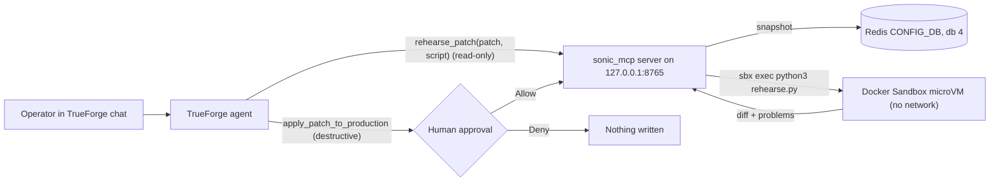

# SONiC Migration Rehearsal Agent

A [TrueForge](https://trueforge.dev) agent that rehearses a change to a SONiC switch's CONFIG_DB before it goes anywhere near production.

You hand it a JSON Patch (RFC 6902, the same format as SONiC's `config apply-patch`). The agent:

1. **Reaches a real tool.** It reads the production CONFIG_DB through an MCP server.
2. **Runs code in a sandbox.** It writes a rehearsal script, and the MCP server runs it inside a [Docker Sandbox](https://docs.docker.com/ai/sandboxes/) (a local microVM with no network) next to a fresh copy of production. The script applies the patch, diffs every table, and finds references that would break (for example, a `VLAN_MEMBER` pointing at a deleted VLAN).
3. **Reports back** in plain language, with the diff and a list of problems.
4. **Stops for a person.** Writing to production is a destructive tool, so TrueForge pauses for Allow or Deny before it runs.

"Production" here is a Redis container holding CONFIG_DB in the layout a real SONiC switch uses: database 4, `TABLE|key` hashes, `field@` list fields, and `NULL` placeholders for empty entries.

## Architecture



- **TrueForge** runs the agent loop, calls the MCP tools, and shows the approval card.
- **`sonic_mcp`** (Python, MCP over streamable HTTP) is the only thing that can read or write production. Its guards run after approval, so they hold even if the agent or the approver gets it wrong.
- **The Docker Sandbox** (`sonic-rehearsal`) runs the agent-written script. For each rehearsal the server writes `snapshot.json`, `patch.json` and `rehearse.py` into `rehearsals/<run_id>/`, then runs `sbx exec` there. The `rehearsals/` folder is the only part of your machine the sandbox can see: no Redis, no `.env`, no repo. Its outbound network is denied, and each run has a time limit.

## Where it stops

| Action | Who decides | Why |
| --- | --- | --- |
| `get_config_snapshot`, `list_backups` | Agent, alone | Read-only (`readOnlyHint`). |
| `rehearse_patch` (runs agent-written code) | Agent, alone | Runs in a microVM with no network, on a copy. It cannot touch production. |
| `apply_patch_to_production`, `restore_backup` | A human, every time | Marked `destructiveHint` **and** named in `require_approval_for_tools`, so the gate holds even if annotations are dropped. |
| Patches touching `DEVICE_METADATA` or `MGMT_INTERFACE` | Nobody | Refused by the server even when approved. A bad management change can cut off access to the switch. |
| Applying a stale rehearsal | Nobody | The apply carries the snapshot's sha256. If production changed since the rehearsal, the server refuses. |
| Whole-config replacement, malformed or non-applying patches, non-string values | Nobody | Refused by the server. |

If something does go wrong, the damage is small. Every apply and every restore first saves a timestamped backup to `backups/`. The write is a single Redis `MULTI/EXEC` transaction, so there are no half-applied changes, and `restore_backup` undoes it.

## Setup

**Prerequisites:** [uv](https://docs.astral.sh/uv/), Docker, Node.js 22 or newer, a model provider API key, and the [Docker Sandboxes `sbx` CLI](https://docs.docker.com/ai/sandboxes/get-started/) signed in with `sbx login`.

```bash
git clone <this repo> && cd trueforge-hackathon
uv sync                     # creates .venv and installs dependencies
cp .env.example .env        # then set TRUEFORGE_MODEL (see step 3)
```

1. **Start "production" and load the sample config.**

   ```bash
   docker compose up -d --wait
   uv run python -m scripts.seed_redis     # re-run any time to reset the demo
   ```

2. **Start TrueForge and allow it to reach the local MCP server.** TrueForge blocks private addresses by default; this allows exactly one.

   ```bash
OUTBOUND_URL_ALLOWED_HOSTS='["127.0.0.1"]' npx @truefoundry/trueforge
   ```

3. **Configure a model in TrueForge** at http://localhost:8790, under Settings, Models. Put the model name (for example `openai/gpt-5.2`) in `TRUEFORGE_MODEL` in `.env`. No TrueForge sandbox provider is needed.

4. **Create the rehearsal sandbox.** This mounts only `rehearsals/`, installs `jsonpatch` from PyPI, then denies all outbound network for this sandbox. It is safe to re-run.

   ```bash
   sbx login                      # once, opens your browser
   sbx policy init balanced       # once per machine, if you have never started a sandbox
   uv run python -m scripts.create_sandbox
   ```

5. **Start the MCP server** (leave it running in its own terminal).

   ```bash
   uv run python -m sonic_mcp.server
   ```

6. **Register the connector and the agent.** This is safe to re-run.

   ```bash
   uv run python -m scripts.create_agent
   ```

7. Open **Agents, sonic-migration-rehearsal** in TrueForge and start a chat.

## Demo script

1. **A patch that would break things.** Paste the contents of [`examples/delete_vlan100.json`](examples/delete_vlan100.json):
   > Rehearse this patch: `[{"op": "remove", "path": "/VLAN/Vlan100"}]`

   Watch the `rehearse_patch` call carrying the agent's script. The report flags the `VLAN_MEMBER` and `VLAN_INTERFACE` entries left pointing at the deleted VLAN, and advises against applying. To show where the code ran, open `rehearsals/<run_id>/` (the files the sandbox saw) and run `sbx ls`.

2. **A safe patch.** Paste [`examples/move_ethernet8_to_vlan200.json`](examples/move_ethernet8_to_vlan200.json) and ask it to rehearse, then apply. The rehearsal is clean. The agent explains what it is about to change, and TrueForge shows the approval card with the exact patch and base hash. Click **Allow**, then check production:

   ```bash
   docker exec sonic-configdb redis-cli -n 4 hget "VLAN|Vlan200" "members@"
   ```

3. **Undo.** Ask the agent to restore the backup. That also pauses for approval.

4. **Refused even when approved.** Ask it to apply [`examples/change_mgmt_gateway.json`](examples/change_mgmt_gateway.json). Approve it; the server still refuses because `MGMT_INTERFACE` is protected.

## Project layout

```
agent/instructions.md      System prompt: rehearsal steps, checks, when to apply
sonic_mcp/configdb.py      CONFIG_DB <-> Redis conversion, read/write, sha256
sonic_mcp/patching.py      Server-side guards and change summary
sonic_mcp/sandbox.py       Run rehearsal scripts in the Docker Sandbox (sbx exec)
sonic_mcp/server.py        MCP tools
sonic_mcp/settings.py      Settings from the environment / .env
scripts/create_sandbox.py  Create the locked-down rehearsal sandbox
scripts/seed_redis.py      Load data/config_db.json into Redis
scripts/create_agent.py    Register the connector and agent in TrueForge
data/config_db.json        Sample switch config (dummy data)
examples/                  Patches used in the demo
tests/                     Unit tests (no Redis needed)
```
