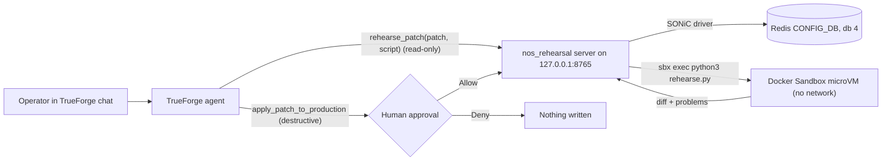

# NOS Rehearsal Agent

A [TrueForge](https://trueforge.dev) agent that rehearses a change to a network device's configuration before it goes anywhere near production. Safely validate, review, and roll back network configuration changes before deployment.


You hand it a JSON Patch (RFC 6902, the same format as SONiC's `config apply-patch`). The agent:

1. **Reaches a real tool.** It reads the production CONFIG_DB through an MCP server.
2. **Runs code in a sandbox.** It writes a rehearsal script, and the MCP server runs it inside a [Docker Sandbox](https://docs.docker.com/ai/sandboxes/) (a local microVM with no network) next to a fresh copy of production. The script applies the patch, diffs every table, and finds references that would break (for example, a `VLAN_MEMBER` pointing at a deleted VLAN).
3. **Reports back** in plain language, with the diff and a list of problems.
4. **Stops for a person.** Writing to production is a destructive tool, so TrueForge pauses for Allow or Deny before it runs.

"Production" here is a Redis container holding CONFIG_DB in the layout a real SONiC switch uses: database 4, `TABLE|key` hashes, `field@` list fields, and `NULL` placeholders for empty entries.

## Architecture



- **TrueForge** runs the agent loop, calls the MCP tools, and shows the approval card.
- **`nos_rehearsal`** (Python, MCP over streamable HTTP) is the only thing that can read or write production. It serves one device from [`devices.yaml`](devices.yaml), using that device's NOS profile and driver. Its guards run after approval, so they hold even if the agent or the approver gets it wrong.
- **The Docker Sandbox** (`sonic-rehearsal`) runs the agent-written script. For each rehearsal the server writes `snapshot.json`, `patch.json` and `rehearse.py` into `rehearsals/<run_id>/`, then runs `sbx exec` there. The `rehearsals/` folder is the only part of your machine the sandbox can see: no Redis, no `.env`, no repo. Its outbound network is denied, and each run has a time limit.

## Where it stops

| Action | Who decides | Why |
| --- | --- | --- |
| `get_config_snapshot`, `list_backups` | Agent, alone | Read-only (`readOnlyHint`). |
| `rehearse_patch` (runs agent-written code) | Agent, alone | Runs in a microVM with no network, on a copy. It cannot touch production. |
| `apply_patch_to_production`, `restore_backup` | A human, every time | Marked `destructiveHint` **and** named in `require_approval_for_tools`, so the gate holds even if annotations are dropped. |
| Patches touching a protected path (for SONiC: `/DEVICE_METADATA`, `/MGMT_INTERFACE`) | Nobody | Refused by the server even when approved, including patches on a parent path. The list lives in the NOS profile. A bad management change can cut off access to the switch. |
| Applying a stale rehearsal | Nobody | The apply carries the snapshot's sha256. If production changed since the rehearsal, the server refuses. |
| Whole-config replacement, malformed or non-applying patches, values of the wrong type for the NOS | Nobody | Refused by the server. |

If something does go wrong, the damage is small. Every apply and every restore first saves a timestamped backup to `backups/`. The SONiC driver writes in a single Redis `MULTI/EXEC` transaction, so there are no half-applied changes, and `restore_backup` undoes it.

## Setup

**Prerequisites:** [uv](https://docs.astral.sh/uv/), Docker, Node.js 22 or newer, a model provider API key, and the [Docker Sandboxes `sbx` CLI](https://docs.docker.com/ai/sandboxes/get-started/). Once per machine:

```bash
sbx login                      # opens your browser
sbx policy init balanced       # if you have never started a sandbox
```

### One command

```bash
git clone https://github.com/srini047/nos-rehersal-agent.git
# Check into the directory
./scripts/install.sh
```

This runs the manual steps below. It creates `.env` from `.env.example` if you don't have one, and starts TrueForge and the MCP server in the background (logs in `logs/`) unless something is already on their ports. On a fresh TrueForge it pauses so you can add a model at http://localhost:8790 under Settings, Models, and set `TRUEFORGE_MODEL` in `.env`. It is safe to re-run.

`./scripts/cleanup.sh` stops what `install.sh` started and takes Redis down. It keeps the sandbox, `.env`, `backups/` and `rehearsals/`.

### Manual setup

```bash
git clone https://github.com/srini047/nos-rehersal-agent.git
# Check into the directory
uv sync
cp .env.example .env
```

1. **Start "production" and load the sample config.**

   ```bash
   docker compose up -d --wait
   uv run python -m scripts.seed_device    # re-run any time to reset to defaults
   ```

2. **Start TrueForge and allow it to reach the local MCP server.** TrueForge blocks private addresses by default; this allows exactly one.

   ```bash
OUTBOUND_URL_ALLOWED_HOSTS='["127.0.0.1"]' npx @truefoundry/trueforge
   ```

3. **Configure a model in TrueForge** at http://localhost:8790, under Settings, Models. Put the model name (for example `openai/gpt-5.2`) in `TRUEFORGE_MODEL` in `.env`. No TrueForge sandbox provider is needed.

4. **Create the rehearsal sandbox.** This mounts only `rehearsals/`, installs `jsonpatch` from PyPI, then denies all outbound network for this sandbox. It is safe to re-run.

   ```bash
   uv run python -m scripts.create_sandbox
   ```

5. **Start the MCP server** (leave it running in its own terminal).

   ```bash
   uv run python -m nos_rehearsal.server
   ```

6. **Register the connector and the agent.** The connector is named after the device (`lab-sonic-01`), and the agent's instructions include the NOS profile's reference checks and protected paths. This is safe to re-run.

   ```bash
   uv run python -m scripts.create_agent
   ```

7. Open **Agents, sonic-migration-rehearsal** in TrueForge and start a chat.

## Demo script

1. **A patch that would break things.** Paste the contents of [`examples/sonic/delete_vlan100.json`](examples/sonic/delete_vlan100.json):
   > Rehearse this patch: `[{"op": "remove", "path": "/VLAN/Vlan100"}]`

   Watch the `rehearse_patch` call carrying the agent's script. The report flags the `VLAN_MEMBER` and `VLAN_INTERFACE` entries left pointing at the deleted VLAN, and advises against applying. To show where the code ran, open `rehearsals/<run_id>/` (the files the sandbox saw) and run `sbx ls`.

2. **A safe patch.** Paste [`examples/sonic/move_ethernet8_to_vlan200.json`](examples/sonic/move_ethernet8_to_vlan200.json) and ask it to rehearse, then apply. The rehearsal is clean. The agent explains what it is about to change, and TrueForge shows the approval card with the exact patch and base hash. Click **Allow**, then check production:

   ```bash
   docker exec sonic-configdb redis-cli -n 4 hget "VLAN|Vlan200" "members@"
   ```

3. **Undo.** Ask the agent to restore the backup. That also pauses for approval.

4. **Refused even when approved.** Ask it to apply [`examples/sonic/change_mgmt_gateway.json`](examples/sonic/change_mgmt_gateway.json). Approve it; the server still refuses because `MGMT_INTERFACE` is protected.

## Adding a NOS

The harness pieces (sandbox rehearsal, approval gate, stale-hash check, protected paths, backups) do not depend on the NOS. A NOS is two things:

1. **A profile**: `nos_rehearsal/nos/<vendor>/<nos>/nos.yaml` (or `nos.json`), holding data only. See the [SONiC profile](nos_rehearsal/nos/sonic/nos.yaml). Profiles are validated strictly at startup; an unknown field or driver stops the server.
2. **A driver**: a class with `read_config()` and `write_config(config)` (see [`nos/base.py`](nos_rehearsal/nos/base.py)), registered by key in [`nos/__init__.py`](nos_rehearsal/nos/__init__.py). A profile can only name a registered driver, never an arbitrary import path.

Then add the device to `devices.yaml`, with any secrets as `${ENV_VAR}` references.

For example, a Nokia SR Linux profile could look like this (not shipped):

```yaml
id: nokia-srlinux
name: Nokia SR Linux
vendor: nokia
driver: nokia-srlinux-gnmi          # a driver using gNMI, with `commit confirmed` on write
value_types: [string, number, boolean]
protected_paths:
  - /system/management
  - /system/aaa
  - /network-instance/mgmt
checks:
  - id: subinterface-parent
    description: "Every `/network-instance/<ni>/interface/<name>` must match an existing `/interface/<port>/subinterface/<index>`."
```

For YANG-modeled NOSes, the driver converts keyed lists to maps on read (`interface: [{name: ethernet-1/1, ...}]` becomes `interface: {ethernet-1/1: {...}}`) and back on write, so JSON Patch paths name what they change instead of an array index.
